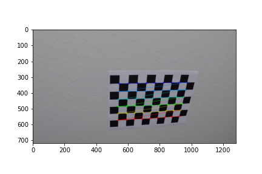

# Advanced Lane Finding

## The Project
---

The goals / steps of this project are the following:

* Compute the camera calibration matrix and distortion coefficients given a set of chessboard images.
* Apply a distortion correction to raw images.
* Use color transforms, gradients, etc., to create a thresholded binary image.
* Apply a perspective transform to rectify binary image ("birds-eye view").
* Detect lane pixels and fit to find the lane boundary.
* Determine the curvature of the lane and vehicle position with respect to center.
* Warp the detected lane boundaries back onto the original image.
* Output visual display of the lane boundaries and numerical estimation of lane curvature and vehicle position.

##Project Structure
---

* [`main.py`](main.py) : contains the code that test the pipeline and augments the video with lanes
* [`lanefinder.py`](lanefinder.py) : the LaneFinder class implementens the various steps for the lane detections
* [`line.py`](lanefinder.py) : the class Line is based on the suggested class from the course and stores various informations about the line
* [`utils.py`](utils.py) : in this module are various functions to extract different informatios from the channels or gradients by applying thresholds 

## Camera Calibration
---
  

         
     

## Pipeline test
---

### Undistorted Image

### Image Transformations

### Perspective Transform

### Lane Identification

### Radius and Position

### Final Output

## Project Video
---

## Discussion
---

