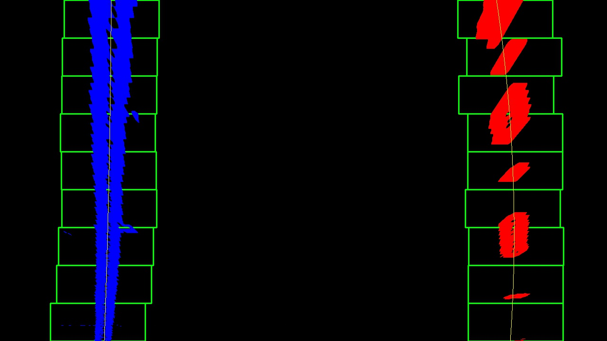

# Advanced Lane Finding
[](http://www.udacity.com/drive)


## The Project
---

The goals / steps of this project are the following:

* Compute the camera calibration matrix and distortion coefficients given a set of chessboard images.
* Apply a distortion correction to raw images.
* Use color transforms, gradients, etc., to create a thresholded binary image.
* Apply a perspective transform to rectify binary image ("birds-eye view").
* Detect lane pixels and fit to find the lane boundary.
* Determine the curvature of the lane and vehicle position with respect to center.
* Warp the detected lane boundaries back onto the original image.
* Output visual display of the lane boundaries and numerical estimation of lane curvature and vehicle position.


##Project Structure
---

* [`main.py`](main.py) : contains the code that test the pipeline and augments the video with lanes
* [`lanefinder.py`](lanefinder.py) : the LaneFinder class implementens the various steps for the lane detections
* [`line.py`](lanefinder.py) : the class Line is based on the suggested class from the course and stores various informations about the line
* [`utils.py`](utils.py) : in this module are various functions to extract different informatios from the channels or gradients by applying thresholds 

## Camera Calibration
---
To work with the camera images, the first step we must do is to correct the distortions. This is done by detecting the corners of chessboards. With the obtained corners and the 3d coordinates(z=0) the opencv function calibrateCamera returns lens distortion coefficients and camera matrix, which can, later on, be used to correct the distortions. All images are now corrected by calling the function undistort. The estimated coefficients and matrix are stored in a file, that not each time the calibration must be done.

Here is an example of a chessboard image with the distorted image and the corrected image:


distorted image            | distortion-corrected image
:-------------------------:|:-------------------------:
  |  


## Pipeline test
---

### Undistorted Image

The first step of our pipeline is to undistort the images. The LaneFinder class are created by passing 
the camera matrix and the distortion coefficients as arguments to the class. They are later used in the method `get_undistored_image`,
where the actual image is corrected. We can clearly see the difference between the undistored and corrected image:

distorted image            | distortion-corrected image
:-------------------------:|:-------------------------:
  |  

### Image Transformations

The next step is to extract the information's from the image to detect the lanes. This is done by applying different thresholds to color spaces. As for color spaces, the HLS and LAB are used. From the HLS color space, the saturation and lightness channels allow separating the lanes from the road. Since the lanes are yellow or white, they have a high saturation and lightness. To these channels are different gradient thresholds(magnitude, directions) applied and combined with saturation and lightness channel. 
Tests with various color spaces have shown, that the LAB color space provides good information about the lane position, especially in areas with shadow. These transformations are done in the method `convert` in the `LaneFinder` class. 

transformations        | warped transformations
:-------------------------:|:-------------------------:
  |  

### Perspective Transform

The perspective transform into bird view with the method `warp_image` from the `LaneFinder` class. For the transformation follow coordinates has been used:

| Source        | Destination   | 
|:-------------:|:-------------:| 
| 592, 450      | 200, 0        | 
| 687, 450      | 1080, 0      |
| 1000, 660     | 1080, 720      |
| 280, 660      | 200, 720        |

The destination coordinates are selected that straight lines in the original image are straight lines in the transformed image.

image with polygon       | warped image with polygon
:-------------------------:|:-------------------------:
  |  

### Lane Identification
The lane is modeled with a quadratic function:


The lane detection starts with the method `find_lanes`.
This method searches for the pixels in two ways:
* The first one is the iterative search, wherein each step a window has applied to the image. Inside this window, the pixels belong to the lane. 
 This approach has been used when one of these conditions match:
  - It's the first image and no line is known.
  - A line has already been found, but the last fit is not a feasible result, so execute an iterative search.
* The second method search around in the area of the previous fit.

After pixels are identified by the method `find_lane_pixels` or `search_around_poly`, the coefficients a,b,c are determined by the method `fit_polynomial`.

The new coefficients are verified if they are feasible in follow manner:
It is the difference between the averaged and the coefficients computed:
```python
self.left_line.diffs = np.abs(self.left_line.best_fit - left_fit)
self.right_line.diffs = np.abs(self.right_line.best_fit - right_fit)
```

If the condition `np.mean(self.left_line.diffs + self.right_line.diffs) > 10` is true, the actual fit is replaced through the averaged coefficients
and the detected line is set to false. 
If the coefficients are valid, they added to a list of the coefficients. The average coefficients are computed when 7 fits are valid.
Here is a example of the pixel detection for a straight line:


### Radius and Position
The radius of the curvature can be computed with follow equation:


This equation is implemented as anonymous function in the method `find_lanes`,line 264. This function expects the coefficients and the y coordinate. 
The vehicle position is computed in the method `draw_lane_info`. 
We assume that the car is in the middle of the image. In the next step, we compute the lane center with the width with the last x coordinates. The offset was obtained by the difference between the lane center and the car position. Finally, it is converted into meter and shown together with curve radius in an info box in the 
center top of the image. To separate between a curve and straight line, we compute the standard deviation of each line. Is the standard deviation small, 
than we show the text straight line instead the curve radius. 

### Final Output

In the final step the lane is marked in the empty warped image. The coordinates of the polygon computed with the fit coefficients. Then the polygon 
is drawn on the empty image and transformed back with the inverse transformation matrix. Then it is combined with original image. 

The final output of the pipeline for a straight line:
 

## Project Video
---

Finally the LaneFinder class is tested on the project video.
 [link to my video result](./project_video_with_lanes.mp4)

          
## Discussion
---


There are a few challenges in this project. The first challenge was to find suitable transformations which work well through the entire video. After trying different combinations of transformations and various kinds of transformations, I found a solution that works well. Anonther challenge was to find an optimal criterium to switch back to iterative pixel search.

The lane is well tracked throughout the entire video. 

The criterium to decide which we restart with the iterative window search can be improved. The algorithm switch back to the iterative pixel search in the curve with the trees on the left side. The viewer can observe this switch. Tuning of the threshold value can improve this that the transition is smoother.
Instead of computing the difference between all coefficients, another improvement compares the coefficients directly. 

Another issue that I have observed is the detection method for the start coordinates in the iterative search. It works not good on the challenge video. The reason is that there is a horizontal line detected, which results that there is no clear peak to find with the original approach. This can be improved by reducing the area which has been used to compute the histogram or the usage of the Sobel in the y-direction.

The current implementation handles situations like driving through a tunnel not good.  The transformations can be adapted to handle such situations appropriately. 


